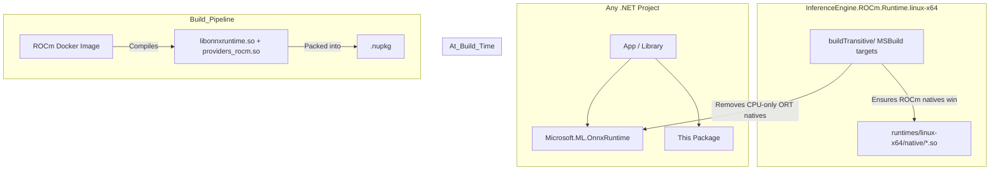

# InferenceEngine.ROCm.Runtime.linux-x64 — Architecture & Build Guide

## 1. Executive Summary

This repository produces **InferenceEngine.ROCm.Runtime.linux-x64**, a native-only NuGet package that ships pre-compiled ROCm-accelerated ONNX Runtime libraries for Linux x64. It is a drop-in replacement for the CPU-only `libonnxruntime.so` shipped by `Microsoft.ML.OnnxRuntime`.

**Core Philosophy:** Fill the "Native Gap" — Microsoft doesn't ship ROCm support for Linux via NuGet, so we compile it and distribute it as a package.

---

## 2. The "Native Gap" Problem

While .NET is cross-platform, high-performance AI inference relies on **native C++ libraries** (`.dll`, `.so`, `.dylib`) to talk to GPU drivers.

* **Windows:** Microsoft provides `Microsoft.ML.OnnxRuntime.DirectML` via NuGet. Works out-of-the-box.
* **macOS:** Microsoft provides CoreML support in the base package. Works out-of-the-box.
* **Linux (AMD GPU):** **CRITICAL GAP.** Microsoft does *not* provide a NuGet package for ROCm (AMD GPU) support on Linux. The standard Linux package is CPU-only.

### The Solution: Docker-Based Compilation + NuGet Distribution

1. **Compile** ONNX Runtime from source with ROCm enabled inside a Docker container.
2. **Package** the resulting `.so` files into a NuGet package with `buildTransitive` targets.
3. **Distribute** via NuGet so any .NET project can get ROCm acceleration by adding a single package reference.

---

## 3. Package Architecture



The `buildTransitive` targets file ensures that when both this package and `Microsoft.ML.OnnxRuntime` are present, the ROCm-enabled natives replace the CPU-only ones for `linux-x64`.

---

## 4. Build System Details

### 4.1. Linux ROCm Compilation (Docker)

**Script:** `scripts/compile_onnx_rocm_docker.sh`

* **Environment:** Uses `rocm/dev-ubuntu-22.04:6.0.2` image to guarantee correct compiler (`hipcc`) and system dependencies.
* **Process:**
    1. Clones specific ONNX Runtime tag (e.g., `v1.19.2`).
    2. Compiles with `--use_rocm` and `--cmake_extra_defines CMAKE_HIP_ARCHITECTURES="gfx1030;gfx1031;gfx1100"`.
    3. **Outputs:** `libonnxruntime.so` and `libonnxruntime_providers_rocm.so` to `artifacts/`.

### 4.2. CI/CD Workflow (`.github/workflows/build-rocm-linux.yml`)

The pipeline has 5 jobs:

1. **build-rocm** — Runs the Docker script to generate `.so` files.
2. **pack-nuget** — Injects `.so` files into `runtimes/linux-x64/native/` and runs `dotnet pack`.
3. **validate-native** — Runs Tier-1 integration tests (ELF format, symbol exports, ORT loading).
4. **publish-github-packages** — Pushes to GitHub Packages (all branches).
5. **create-release** — *(release branch only)* Creates GitHub Release with `.so` + `.nupkg` + checksums, publishes to NuGet.org.

### 4.3. Versioning

Version is computed from the branch name and a repository variable:

| Branch | Format | Example |
| :--- | :--- | :--- |
| `development` | `{VERSION_PREFIX}-dev.{run}` | `1.19.2-dev.42` |
| `staging` | `{VERSION_PREFIX}-rc.{run}` | `1.19.2-rc.58` |
| `release` | `{VERSION_PREFIX}.{run}` | `1.19.2.71` |

`VERSION_PREFIX` is set to the ORT source version (e.g., `1.19.2`) as a GitHub repository variable.

---

## 5. How Consumers Use It

### Standalone (any .NET project)

```xml
<PackageReference Include="Microsoft.ML.OnnxRuntime" Version="1.24.1" />
<PackageReference Include="InferenceEngine.ROCm.Runtime.linux-x64" Version="1.19.2" />
```

The `buildTransitive` targets automatically replace the CPU-only native with the ROCm build at build time. No code changes needed — `OrtEnv.Instance()` and `InferenceSession` pick up the ROCm provider automatically on Linux with AMD GPU.

### Via InferenceEngine.Core

[`InferenceEngine.Core`](https://github.com/intel-agency/inference-engine-lib) references this package. Its `BaseInferenceEngine` detects Linux + AMD GPU at runtime and loads the ROCm execution provider via the string API:

```csharp
if (RuntimeInformation.IsOSPlatform(OSPlatform.Linux))
{
    var rocmOptions = new Dictionary<string, string> { { "device_id", "0" } };
    options.AppendExecutionProvider("ROCmExecutionProvider", rocmOptions);
}
```
