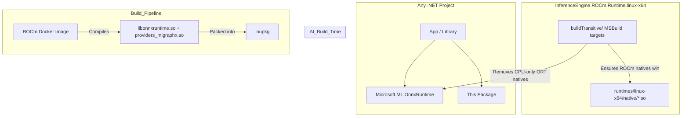

# InferenceEngine.ROCm.Runtime.linux-x64 — Architecture & Build Guide

## 1. Executive Summary

This repository produces **InferenceEngine.ROCm.Runtime.linux-x64**, a native-only NuGet package that ships pre-compiled ROCm-accelerated ONNX Runtime libraries for Linux x64. It is a drop-in replacement for the CPU-only `libonnxruntime.so` shipped by `Microsoft.ML.OnnxRuntime`.

**Core Philosophy:** Fill the "Native Gap" — Microsoft doesn't ship MIGraphX/ROCm support for Linux via NuGet, so we compile it and distribute it as a package.

---

## 2. The "Native Gap" Problem

While .NET is cross-platform, high-performance AI inference relies on **native C++ libraries** (`.dll`, `.so`, `.dylib`) to talk to GPU drivers.

* **Windows:** Microsoft provides `Microsoft.ML.OnnxRuntime.DirectML` via NuGet. Works out-of-the-box.
* **macOS:** Microsoft provides CoreML support in the base package. Works out-of-the-box.
* **Linux (AMD GPU):** **CRITICAL GAP.** Microsoft does *not* provide a NuGet package for ROCm (AMD GPU) support on Linux. The standard Linux package is CPU-only.

### The Solution: Docker-Based Compilation + NuGet Distribution

1. **Compile** ONNX Runtime from source with ROCm enabled inside a Docker container.
2. **Package** the resulting `.so` files into a NuGet package with `buildTransitive` targets.
3. **Distribute** via NuGet so any .NET project can get ROCm acceleration by adding a single package reference.

---

## 3. Package Architecture


```mermaid
graph TD
    subgraph This_Package[InferenceEngine.ROCm.Runtime.linux-x64]
        SO_Files[runtimes/linux-x64/native/*.so]
        Targets[buildTransitive/ MSBuild targets]
    end

    subgraph Consumer_Project[Any .NET Project]
        App[App / Library] --> ORT[Microsoft.ML.OnnxRuntime]
        App --> ROCm_Pkg[This Package]
    end

    subgraph At_Build_Time
        Targets --> |Removes CPU-only ORT natives| ORT
        Targets --> |Ensures ROCm natives win| SO_Files
    end

    subgraph Build_Pipeline
        Docker[ROCm Docker Image] --> |Compiles| NativeSo[libonnxruntime.so + providers_migraphx.so]
        NativeSo --> |Packed into| Nuget[.nupkg]
    end
```

The `buildTransitive` targets file ensures that when both this package and `Microsoft.ML.OnnxRuntime` are present, the MIGraphX-enabled natives replace the CPU-only ones for `linux-x64`.

---

## 4. Build System Details

### 4.1. Linux ROCm Compilation (Docker)

**Script:** `scripts/compile_onnx_rocm_docker.sh`

* **Environment:** Uses `rocm/dev-ubuntu-22.04:7.2.1` image to guarantee correct compiler (`hipcc`), MIGraphX libraries, and system dependencies.
* **Process:**
    1. Clones specific ONNX Runtime tag (e.g., `v1.24.1`).
    2. Compiles with `--use_migraphx` and `--cmake_extra_defines CMAKE_HIP_ARCHITECTURES="gfx1030;gfx1031;gfx1100;gfx1101;gfx1102"`.
    3. **Outputs:** `libonnxruntime.so` and `libonnxruntime_providers_migraphx.so` to `artifacts/`.

### 4.2. CI/CD Workflow (`.github/workflows/build-rocm-linux.yml`)

The pipeline has 5 jobs:

1. **build-rocm** — Runs the Docker script to generate `.so` files.
2. **pack-nuget** — Injects `.so` files into `runtimes/linux-x64/native/` and runs `dotnet pack`.
3. **validate-native** — Runs the 13 Tier-1 integration tests (ELF format, symbol exports, managed load, identity inference, clean-exception failure path, plus the couplet gates: `EXPECTED_ORT_VERSION` match and the `libmigraphx_c.so.3` SONAME check). No GPU required — see the README's *Validation strategy* section.
4. **publish-github-packages** — Pushes to GitHub Packages (all branches).
5. **create-release** — *(release branch only)* Creates GitHub Release with `.so` + `.nupkg` + checksums, publishes to NuGet.org.

### 4.3. Versioning

Version is computed from the branch name and a repository variable:

| Branch | Format | Example |
| :--- | :--- | :--- |
| `development` | `{VERSION_PREFIX}-dev.{run}` | `1.24.1-dev.42` |
| `staging` | `{VERSION_PREFIX}-rc.{run}` | `1.24.1-rc.58` |
| `release` | `{VERSION_PREFIX}.{run}` | `1.24.1.71` |

`VERSION_PREFIX` is set to the ORT source version (e.g., `1.24.1`) as a GitHub repository variable.

### 4.4. Debug Symbols

Native libraries are compiled with debug info (`-g` via `--cmake_extra_defines CMAKE_C_FLAGS_RELEASE` / `CMAKE_CXX_FLAGS_RELEASE` in `scripts/compile_onnx_rocm_docker.sh`). The CI pipeline then splits the DWARF data from each binary before packing:

1. **Split** — `objcopy --only-keep-debug` extracts the DWARF sections into `debuginfo/<lib>-<BuildID>.debug` files, uploaded to the GitHub Release as separate assets.
2. **Strip** — the `.so` files that go into the NuGet package are stripped with `objcopy --strip-debug`: DWARF is removed, but `.symtab` is kept so backtraces symbolicate. (Never `--strip-all` — that removes `.symtab` and breaks backtrace symbolication.)
3. **Checksums** — every released asset (`.so`, `.debug`, `.nupkg`) is covered by `SHA256SUMS.txt`.

To debug a shipped binary, find its Build ID, download the matching `.debug` asset from the release, and load it:

```bash
# 1. Find your binary's Build ID
readelf -n libonnxruntime.so
#   Build ID: 1a2b3c4d5e...

# 2a. Load explicitly in gdb (when inspecting the library standalone)
gdb ./libonnxruntime.so
(gdb) symbol-file /path/to/libonnxruntime.so-1a2b3c4d5e.debug
# (For a live process with the library loaded, prefer 2b — symbol-file
#  there would replace the main executable's symbols.)

# 2b. Or install it where debuggers auto-discover it (first 2 hex chars
#     as the subdirectory, the rest as the filename + .debug suffix):
install -Dm644 libonnxruntime.so-1a2b3c4d5e.debug \
  /usr/lib/debug/.build-id/1a/2b3c4d5e.debug
```

### 4.5. Build Provenance & Attestation

Every `.nupkg` produced by CI carries a SLSA build-provenance attestation, generated by `actions/attest-build-provenance` in the `pack-nuget` job. Verify a downloaded package against this repository:

```bash
gh attestation verify <file.nupkg> --repo intel-agency/inference-engine-rocm
```

The `create-release` job additionally runs behind the `release` GitHub environment (required reviewers) and pins release tags to the exact release commit via `target_commitish`.

---

## 5. How Consumers Use It

### Host requirements

The ROCm/MIGraphX dependencies live in `libonnxruntime_providers_migraphx.so` (its `DT_NEEDED` entries require `libmigraphx_c.so.3` and `libamdhip64.so.7`, readelf-verified); the core `libonnxruntime.so` has no hard ROCm dependency. Consumers therefore need **ROCm 7.x userspace with the MIGraphX runtime** plus the `amdgpu`/KFD kernel driver for GPU execution; verified GPU targets are `gfx1030`/`gfx1031` (RDNA2) and `gfx1100`/`gfx1101`/`gfx1102` (RDNA3). Without a GPU or ROCm the package still loads and runs CPU-only. Full details in the README's *Host requirements* section.

### Standalone (any .NET project)

```xml
<PackageReference Include="Microsoft.ML.OnnxRuntime" Version="1.24.1" />
<PackageReference Include="InferenceEngine.ROCm.Runtime.linux-x64" Version="1.24.1" />
```

The `buildTransitive` targets automatically replace the CPU-only native with the MIGraphX build at build time (mechanism in the README's *How it works* section). No code changes needed — `OrtEnv.Instance()` and `InferenceSession` pick up the MIGraphX provider automatically on Linux with AMD GPU.

### Via InferenceEngine.Core

[`InferenceEngine.Core`](https://github.com/intel-agency/inference-engine-lib) references this package. Its `BaseInferenceEngine` detects Linux + AMD GPU at runtime and loads the MIGraphX execution provider via the string API:

```csharp
if (RuntimeInformation.IsOSPlatform(OSPlatform.Linux))
{
    var migraphxOptions = new Dictionary<string, string> { { "device_id", "0" } };
    options.AppendExecutionProvider("MIGraphXExecutionProvider", migraphxOptions);
}
```
