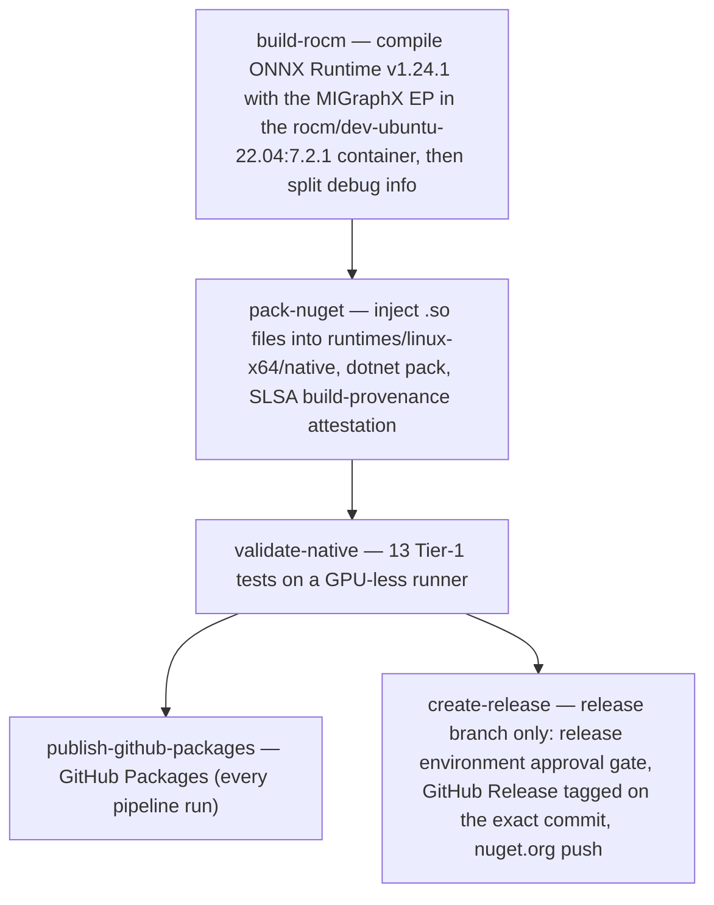

# InferenceEngine.ROCm.Runtime.linux-x64

Pre-built ONNX Runtime native libraries for Linux x64 with the MIGraphX Execution Provider — AMD GPU inference for .NET, without compiling ONNX Runtime from source.

[](https://github.com/intel-agency/inference-engine-rocm/actions/workflows/build-rocm-linux.yml?query=branch%3Arelease)
[](https://www.nuget.org/packages/InferenceEngine.ROCm.Runtime.linux-x64)
[](https://www.nuget.org/packages/InferenceEngine.ROCm.Runtime.linux-x64)
[](LICENSE)

## The native gap

The ONNX Runtime NuGet packages Microsoft ships cover three of the four platform combinations:

| Platform | GPU stack | NuGet package |
| :--- | :--- | :--- |
| Windows | DirectX 12 | [`Microsoft.ML.OnnxRuntime.DirectML`](https://www.nuget.org/packages/Microsoft.ML.OnnxRuntime.DirectML) |
| macOS | CoreML | base package |
| Linux | CUDA (NVIDIA) | [`Microsoft.ML.OnnxRuntime.Gpu`](https://www.nuget.org/packages/Microsoft.ML.OnnxRuntime.Gpu) |
| Linux | ROCm (AMD) | **none** — the base package ships a CPU-only `libonnxruntime.so` |

On Linux + AMD, there is nothing to install: any cross-platform .NET inference library built on these packages runs the CPU execution provider, silently. The remaining option — compiling ONNX Runtime from source — is a 30–60 minute Docker build with ROCm toolchain and CMake version pinning.

This package ships that build as a package: ONNX Runtime v1.24.1 compiled with `--use_migraphx` against the ROCm 7.2.1 toolchain, drop-in replacing the CPU-only native.

## Quick start

```bash
dotnet add package Microsoft.ML.OnnxRuntime
# and on Linux x64:
dotnet add package InferenceEngine.ROCm.Runtime.linux-x64
```

```csharp
using Microsoft.ML.OnnxRuntime;

using var options = new SessionOptions();

// Typed overload in Microsoft.ML.OnnxRuntime 1.24.1; `0` is the HIP device id.
options.AppendExecutionProvider_MIGraphX(0);

// Equivalent string API — the provider name the native library registers:
// options.AppendExecutionProvider(
//     "MIGraphXExecutionProvider",
//     new Dictionary<string, string> { ["device_id"] = "0" });

using var session = new InferenceSession("model.onnx", options);
```

Mechanics worth knowing:

- The managed package has no ROCm dependency. Its 1.24.1 API documents `AppendExecutionProvider_MIGraphX(int)` with *"Use only if you have the onnxruntime package specific to this Execution Provider"* — that provider-specific package is this one.
- On a host without the ROCm/MIGraphX runtime, requesting the EP throws a managed `OnnxRuntimeException` from the `AppendExecutionProvider_MIGraphX` call itself — a clean exception, never a native crash (Tier-1 asserts this; see [Validation strategy](#validation-strategy)). Omit the EP call and the same native library loads and runs CPU-only.

## How it works

### Native asset precedence

`Microsoft.ML.OnnxRuntime` already ships a CPU-only `libonnxruntime.so` under its own `runtimes/linux-x64/native/`. When both packages are referenced, NuGet resolves both sets of native assets into the same `RuntimeCopyLocalItems` list, and the copy order between two packages is not a contract you can rely on — you could get either library on disk.

[`buildTransitive/InferenceEngine.ROCm.Runtime.linux-x64.targets`](InferenceEngine.Core/buildTransitive/InferenceEngine.ROCm.Runtime.linux-x64.targets) makes the selection deterministic. It runs after `ResolvePackageAssets` (before files are copied to the output directory) and:

1. Selects this package's native `linux-x64` assets from `RuntimeCopyLocalItems`.
2. Removes every native `linux-x64` asset whose package id starts with `Microsoft.ML.OnnxRuntime` (the CPU library and its companions).
3. Re-adds this package's assets (remove-then-add, so no duplicates).

An **empty-package guard** wraps all of this: steps 2–3 only run when this package actually contributed `linux-x64` native assets. A package built without the `.so` files (for example, a local `dotnet pack` with no ROCm build behind it) leaves the CPU library in place — the consumer ends up with a working CPU build rather than no native ONNX Runtime at all.

### Why native-only, and netstandard2.0

The package contains no managed code. The managed bindings already exist in `Microsoft.ML.OnnxRuntime`; shipping a second managed surface would fork an API that upstream owns and force consumers to keep two call layers in sync. The package carries exactly two things: `runtimes/linux-x64/native/*.so` and the `buildTransitive` targets. `netstandard2.0` is the broadest target framework for an MSBuild asset package — the assets and targets flow into any .NET (Core/Framework/5+) consumer.

## Host requirements

| Component | Requirement |
| :--- | :--- |
| OS | Linux x64 |
| ROCm userspace | **7.x with the MIGraphX runtime** — the provider library declares `DT_NEEDED` entries for `libmigraphx_c.so.3` and `libamdhip64.so.7` (readelf-verified). "Any ROCm 5.x+" is not sufficient. |
| Kernel driver | `amdgpu` (KFD) |
| GPU | Optional. Verified targets: `gfx1030`, `gfx1031` (RDNA2 — RX 6800/6900, RX 6700 series), `gfx1100`, `gfx1101`, `gfx1102` (RDNA3 — RX 7900 and siblings) |
| .NET | Any TFM (native-only package). Managed bindings: `Microsoft.ML.OnnxRuntime` 1.24.1 |

The ROCm dependencies live in `libonnxruntime_providers_migraphx.so`, which is loaded only when the MIGraphX EP is requested. The core `libonnxruntime.so` has no hard ROCm dependency: without a GPU or ROCm, the package still loads and runs CPU-only.

The provider library is loaded only when the MIGraphX EP is requested; its mere presence in an application directory (which is where NuGet places it for every consumer) is harmless on machines without ROCm — requesting the EP there throws the clean managed exception described above.

## Couplet compatibility

The package version, the ONNX Runtime source it was built from, and the ROCm toolchain are a **couplet** — they move together and are validated together (see [`plan_docs/Multi-Version-Branching-Strategy.md`](plan_docs/Multi-Version-Branching-Strategy.md)):

| Package | ONNX Runtime | ROCm | Execution provider | Required host libs |
| :--- | :--- | :--- | :--- | :--- |
| `1.24.1.N` | 1.24.1 | 7.2.1 | MIGraphX | `libmigraphx_c.so.3`, `libamdhip64.so.7` |
| `1.30.0.N` *(planned)* | 1.30.0 | 7.2.4 | MIGraphX | unchanged — ROCm 7.2.4 keeps the same SONAME generation, so existing hosts keep working |

`N` is the CI run number. Versions through `1.24.1.36` were internal (GitHub Packages) releases of the same couplet; the first public nuget.org release is upcoming.

### Migrating from the ROCm execution provider

The ROCm EP is deprecated upstream; MIGraphX EP is its successor. Consumers of the older `1.19.2` / ROCm 6.0.2 packages need a package-version bump plus the EP switch — `AppendExecutionProvider_ROCm(0)` becomes `AppendExecutionProvider_MIGraphX(0)` (or the string API with `"MIGraphXExecutionProvider"`), and `libonnxruntime_providers_rocm.so` becomes `libonnxruntime_providers_migraphx.so`. The full checklist, including provider-option differences, is in [`plan_docs/MIGraphX-Downstream-Migration-Guide.md`](plan_docs/MIGraphX-Downstream-Migration-Guide.md).

## Build pipeline

`build-rocm-linux.yml` runs five jobs:



Details that pin the build environment:

- **Containerized toolchain.** The compile runs in `rocm/dev-ubuntu-22.04:7.2.1`, which pins `hipcc`, the MIGraphX dev headers, and the ROCm component libraries. `--skip_tests` compensates for the container having no GPU; code is generated for five targets via `CMAKE_HIP_ARCHITECTURES="gfx1030;gfx1031;gfx1100;gfx1101;gfx1102"`.
- **Eigen is commit-pinned.** ORT v1.24.1's dependency list pins Eigen commit `1d8b82b0`, and the script pre-clones [`eigen-mirror/eigen`](https://github.com/eigen-mirror/eigen) at that exact commit, then points CMake at the checkout via `FETCHCONTENT_SOURCE_DIR_EIGEN`. This dodges the tarball-hash instability of the default FetchContent download path — a moved or regenerated tarball would otherwise fail the build on a hash mismatch.
- **`rocm_version.h` is rewritten.** Newer ROCm images ship `include/rocm_version.h` in a format ORT's CMake cannot parse. The script detects the version from four fallback sources and rewrites the header to the plain three-`#define` format (`ROCM_VERSION_MAJOR/MINOR/PATCH`) that ORT v1.24.1's CMake expects.

## Validation strategy

**Tier-1** ([`InferenceEngine.Core.IntegrationTests`](InferenceEngine.Core.IntegrationTests/), 13 tests) runs on GPU-less Linux runners in every build:

- **Structural** — the three `.so` files exist and are non-empty; `file` confirms ELF64 shared objects; `nm -D` confirms symbol exports (`OrtGetApiBase` in the core library, MIGraphX EP entry points in the provider).
- **Behavioral** — `OrtEnv` initializes; an identity model loads and infers correctly on CPU (input 42 → output 42); requesting the MIGraphX EP on a GPU-less runner produces a managed `OnnxRuntimeException`, proving the failure path is a clean exception rather than `SIGABRT`.
- **Couplet gates** — the loaded native ORT version must match `EXPECTED_ORT_VERSION` (injected by CI to match `ORT_TAG`; local runs fall back to the managed assembly version), and `readelf -d` must show `DT_NEEDED libmigraphx_c.so.3` in the provider — SONAME drift means the couplet's minimum host ROCm changed.

The provider `.so` is deliberately kept out of the test output directory: the on-disk tests (structure, symbols, SONAME) reach it through a `NATIVE_LIBS_DIR` path without loading it, so the suite never depends on — or disturbs — the host's ROCm state. (Keeping it out of the app directory is conservatism, not necessity; see [Host requirements](#host-requirements).)

**Tier-2** — validation on real AMD hardware, including CPU-vs-GPU tolerance checks — is planned; see [`plan_docs/Tier2-GPU-Validation-Plan.md`](plan_docs/Tier2-GPU-Validation-Plan.md).

Every published `.nupkg` also carries a verifiable build attestation:

```bash
gh attestation verify <file.nupkg> --repo intel-agency/inference-engine-rocm
```

## Provenance and supply chain

- **SLSA build provenance** — generated for every `.nupkg` in the pack job; verify with the command above.
- **Checksums** — `SHA256SUMS.txt` covers every release asset (`.so`, `.debug`, `.nupkg`); run `sha256sum -c SHA256SUMS.txt` in the download directory.
- **Tags on exact commits** — release tags are created with `target_commitish` pinned to the release commit; the commits themselves are GPG-signed.
- **nuspec commit pinning** — the package's `<repository>` metadata records the exact commit the binaries were built from.
- **Split debug info** — DWARF is split per-Build-ID into `.debug` release assets; the shipped `.so` files are stripped of DWARF but keep `.symtab`, so backtraces still symbolicate. Debugging a shipped binary: match its `readelf -n` Build ID against the release assets (details in [ARCHITECTURE.md](ARCHITECTURE.md), section 4.4).
- **Gated publish** — the `create-release` job runs behind the `release` GitHub environment (required reviewers) and fails fast if the NuGet API key is not configured.

## Versioning and branch model

| Branch | Version format | Example |
| :--- | :--- | :--- |
| `development` | `{VERSION_PREFIX}-dev.{run_number}` | `1.24.1-dev.42` |
| `staging` | `{VERSION_PREFIX}-rc.{run_number}` | `1.24.1-rc.58` |
| `release` | `{VERSION_PREFIX}.{run_number}` | `1.24.1.71` |

- `VERSION_PREFIX` is the ONNX Runtime source version of the current couplet (a GitHub repository variable, currently `1.24.1`), so package versions state exactly which ORT they contain.
- The run number is the monotonic GitHub Actions run number — every version is unique and traceable to a CI run.
- Flow: `development` → `staging` → `release`, with a continuous publish on `release` (`development` → GitHub Packages only; `staging` adds `-rc` packages; `release` triggers the gated public publish). `master` mirrors the release line. Integration is merge-commit-only; every commit is GPG-signed.

## Building from source

The native libraries compile from ONNX Runtime source inside the ROCm container (30–60 minutes):

```bash
docker run --rm -v "$(pwd)":/code -w /code \
  rocm/dev-ubuntu-22.04:7.2.1 \
  /code/scripts/compile_onnx_rocm_docker.sh
```

Output lands in `artifacts/`. To pack locally:

```bash
cp artifacts/*.so InferenceEngine.Core/runtimes/linux-x64/native/
dotnet pack InferenceEngine.Core/
```

Repository layout:

```text
InferenceEngine.Core/                            # Package project (native-only, no managed code)
  InferenceEngine.ROCm.Runtime.linux-x64.csproj  # NuGet packaging
  buildTransitive/                               # MSBuild targets for native asset precedence
  runtimes/linux-x64/native/                     # .so files (injected by CI)
InferenceEngine.Core.IntegrationTests/           # 13 Tier-1 validation tests (no GPU required)
scripts/compile_onnx_rocm_docker.sh              # Docker-based ROCm compilation
.github/workflows/build-rocm-linux.yml           # 5-job build/pack/validate/publish/release pipeline
plan_docs/                                       # Planning docs: couplet strategy, migration, validation
```

Further documentation:

| Document | Contents |
| :--- | :--- |
| [ARCHITECTURE.md](ARCHITECTURE.md) | Package architecture, build system internals, debug symbols, attestation |
| [plan_docs/MIGraphX-Downstream-Migration-Guide.md](plan_docs/MIGraphX-Downstream-Migration-Guide.md) | Migrating from the ROCm-EP packages to this one |
| [plan_docs/Multi-Version-Branching-Strategy.md](plan_docs/Multi-Version-Branching-Strategy.md) | Maintaining multiple ORT + ROCm couplets |
| [plan_docs/Tier2-GPU-Validation-Plan.md](plan_docs/Tier2-GPU-Validation-Plan.md) | Planned GPU-hardware validation |
| [CHANGELOG.md](CHANGELOG.md) · [CONTRIBUTING.md](CONTRIBUTING.md) · [SECURITY.md](SECURITY.md) | Release history, contribution guide, security policy |

## License

[MIT](LICENSE). [`LICENSE`](LICENSE) and [`THIRD-PARTY-NOTICES.txt`](THIRD-PARTY-NOTICES.txt) ship in the repository and in the NuGet package root. The notices cover the redistributed binaries — ONNX Runtime (MIT) — and the ROCm/MIGraphX components that are loaded from the host system at run time rather than redistributed. Internal package versions through `1.24.1.36` were licensed AGPL-3.0-or-later; the MIT license applies from the first public release onward (see [CHANGELOG.md](CHANGELOG.md)).
